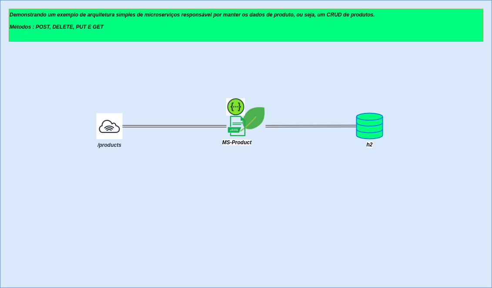

# Micro-services Orders With Kafka

## Introdução

O Desafio proposto é um [CRUD] de pedidos que fará interação com o Kafka para atualização de status conforme arquitetura proposta abaixo.

## Pré-Requisitos

* Java 1.8 ou Java 11
* Banco H2
* Spring-Boot.
* Swagger
* Testes unitários  -JUnit
